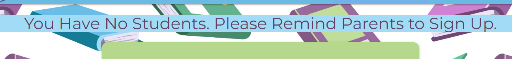

# LIT TRACK

LitTrack is a digital reading record for young children to record their learning to read journey.
Parents can log reading sessions they have completed at home, and they can view all reading sessions completed both at home and in school for all their children in one place.
Teachers can log sessions, view all sessions of all the children in their class, they can update reading levels for the whole class from one page and can update the teacher of the students in the same way. 
It is quick and easy to use for all users. 

The website is designed to be fully responsive, allowing visitors to view it on a wide range of devices.


I used [https://ui.dev/amiresponsive](https://ui.dev/amiresponsive?url=https://lit-track-313aa42e46f6.herokuapp.com) to create this image.

## UX

### Colour Scheme

I used [coolors.co](https://coolors.co/e84610-009fe3-4a4a4f-445261-d63649-e6ecf0-000000) to generate my colour palette.


- `#673C66` used for card panels on login/register pages and modals.
- `#A661A7` used for buttons.
- `#ADD982` used for card panels throughout site.
- `#CCE7B1` used for student individual card panels.
- `#48BDE8` used for the navbar and footer.
- `#90DDF8` used for flash messages.

I've used CSS `:root` variables to easily update the global colour scheme by changing only one value, instead of everywhere in the CSS file.

```css
:root {
    --plum: #673C66;
    --celadon: #CCE7B1;
    --pistachio: #ADD982;
    --sky-blue: #90DDF8;
    --aero: #48BDE8;
    --dark-mauve: #A661A7;
    /* Overriding standard materialize colours */
    --primary-color: var(--plum);
    --font-color-main: var(--plum);
    --font-color-medium: var(--plum);
    --font-color-disabled: var(--aero);
}
```

### Typography

- [Montserrat](https://fonts.google.com/specimen/Montserrat) was used for the primary headers and titles.

- [Roboto](https://fonts.google.com/specimen/Roboto) was used for all other secondary text.

- [Font Awesome](https://fontawesome.com) icons were used throughout the site.

## User Stories

### New Site Users

- As a new site user, I would like to understand what the site is about, so that I can decide whether I would like to use it.
- As a new site user, I would like to create an account, so that I can use the site.

### Parent Users

- As a parent user, I would like to easily add my children, so that I can start their digital reading record.
- As a parent user, I would like to edit my child's information, so that I can correct a mistake.
- As a parent user, I would like to be able to view my child's information, so that I can see their reading level and teacher at a glance.
- As a parent site user, I would like to easily log a reading session, so that I can quickly and easily add to their reading record.
- As a parent site user, I would like to easily view my child's reading sessions, so I can see how much they are reading and how much progress they are making.
- As a parent site user, I would like to edit a reading session I have logged, so that I can correct a mistake.
- As a parent user, I would like to do all the above for ALL my children from a single account.
- As a parent user, I would like to see reading sessions for all my children together, but also have the option to view them for one particular child.
- As a parent site user, I would like to have the option to delete a reading session I have logged.
- As a parent user, I would like the option to delete my child and all their information, once they have left school.
- As a parent site user, I would like the option to delete my account once all my children have left school.


### Teacher users

- As a teacher user, I should be able to see which of my students have been reading and how often, so that I can keep track of their progress.
- As a teacher user, I should be able to see at a glance whether each session has been completed at home or in school, so that I can keep track of which students may need extra reading practise.
- As a teacher user, I should be able to search for a book title, so I can see if a student has already read a particular book.
- As a teacher user, I should be able to filter the list of reading sessions by student, so I can focus on them individually sometimes.
- As a teacher user, I should be able to log reading sessions students complete in school, so that parents are aware of these.
- As a teacher user, I should be able to edit a reading session, so that I can correct a mistake.
- As a teacher user, I should be able to delete a reading session.
- As a teacher user, I should be able to edit student details, so that I can update their teacher or reading level.
- As a teacher user, I should be able to edit student reading levels for the whole class from one place, so that I can update them quickly after assessments.
- As a teacher user, I should be able to edit the teacher for the whole class from one place, so that I can update them quickly if the teachers or classes are changing.
- As a teacher site user, I would like the option to delete my account.

## Wireframes

⚠️⚠️⚠️⚠️⚠️ START OF NOTES (to be deleted) ⚠️⚠️⚠️⚠️⚠️

In this section, display your wireframe screenshots using a Markdown `table`.

Instructions on how to do Markdown `tables` start on line #213 on this site: https://pandao.github.io/editor.md/en.html

🛑🛑🛑🛑🛑 END OF NOTES (to be deleted) 🛑🛑🛑🛑🛑

To follow best practice, wireframes were developed for mobile, tablet, and desktop sizes.
I've used [Balsamiq](https://balsamiq.com/wireframes) to design my site wireframes.

### Home Page Wireframes

| Size | Screenshot |
| --- | --- |
| Mobile |  |
| Tablet |  |
| Desktop |  |

### About Page Wireframes

| Size | Screenshot |
| --- | --- |
| Mobile |  |
| Tablet |  |
| Desktop |  |

### Contact Page Wireframes

| Size | Screenshot |
| --- | --- |
| Mobile |  |
| Tablet |  |
| Desktop |  |

## Features

### Existing Features

- **Navbar**

    - If the user is not currently logged in, the only links on the navbar are login and register. The main logo on the left hand side links to the login page.
    - If the user is logged in, the full menu is displayed.
    - The navbar collapses for small devices.


- **Registration Page**

    - Requires a registration code to either register as a teacher or parent. Users must choose a username, this has a pattern attribute to ensure it cannot be left blank.
    - Password has a pattern attribute to ensure passwords contain a minimum of 6 characters, a lowercase letter, an uppercase letter and a digit.
    - Has a link to find out more about the website.
    - Has a link to the login page


- **About Us Page**

    - Contains a list of benefits of the site for both parents and the school, with a register and login page at the bottom to encourage people to sign up


- **Login Page**

    - This is the main home landing page, as the majority of visitors to the site will be current users who want to log in in the minimum number of clicks possible.
    - Contains links to find out more about the website and to the registration page for new users.


- **Incorrect Username/Password**

    - If a user enters an incorrect username or password, this flash message will display and the user will be directed back to the login page.
    - The message does not say whether the username or the password is incorrect, this is to improve app security.


- **Welcome Messages**

    - A flash message is displayed on registering/login.


- **My Reading Sessions**

    - This is the page users are directed to on login.
    - It displays a list of all reading sessions for that users students/children in a collapsible.
    - The collapsible header contains the student name, date of session and a home/school icon to show if the reading session was completed at home or in school.
    - When a reading session is clicked on it reveals more information: the book title, book level and an optional comment written by the person who has logged the session.
    - If the current user is the person who has logged the reading session, it will also show buttons with the options to edit or delete the session.


- **Search Book Titles**

    - At the top of the reading sessions page there is a search bar which searches both the book title and comments.


- **Filter**

    - At the top of the reading sessions page there is also a dropdown to filter the sessions by student. The user is able to select multiple students.


- **Reset Button**

    - Next to the search bar and filter dropdown there is a reset button to return to the full list of reading sessions. This means the user will not need to use the back button to return to the full list.


- **Edit Reading Session**

    - If the user is the author of a reading session, the edit button will be visible when the collapsible is opened (as shown above). 
    - The edit form is prepopulated with all the current information from the database.
    - The student/child must be chosen from a dropdown list of only students/children of the user.
    - The date must be chosen from a datepicker. You cannot select a date in the future.
    - The reading level must be chosen from a dropdown list.


- **Delete Reading Session**

    - If the user is the author of a reading session, the delete button will be visible when the collapsible is opened (as shown above). 
    - This button triggers a modal to avoid accidental deletion.


- **Log a Reading Session Page**

    - The student/child must be chosen from a dropdown list of only students/children of the user.
    - The date must be chosen from a datepicker. You cannot select a date in the future.
    - The reading level must be chosen from a dropdown list.
    - The book title has a minimum and maximum number of characters to stop it being left blank.
    - The comment is optional (being forced to write a comment can put people off logging a session).


- **My Children/ My Students**

    - The heading will say 'My Children' for parent users and 'My Students' for teacher users.
    - A button to add students is visible for parents.
    - Buttons to update all reading levels or update all students' teachers are visible to teachers.


- **Individual Student Card Panels**

    - There is an individual card panel showing basic information for each student - name and current reading level.
    - For parent users the student's teacher is also listed.
    - Contains buttons to edit and delete the student.


- **Edit Student**

    - The edit form is prepopulated with all the current information from the database.
    - The reading level must be chosen from a dropdown list.
    - The teacher must be chosen from a dropdown list.


- **Delete Student**

    - This button triggers a modal to avoid accidental deletion.
    - Deleting a student also deletes all their logged reading sessions (the user is reminded of this in the modal).


- **Add Student**

    - Only parents can add students to the database. 
    - Parents select the teacher from a dropdown list.
    - Parents can add as many children as they want to their single user account for the app.


- **Delete Account**

    - When this button is clicked, if a user (either teacher or parent) has students linked to their account, a modal will be triggered telling them that they must delete (if a parent) or delete/reassign (if a teacher) all their students before they can delete the account.
    -If the user has no students linked to their account a modal will be triggered asking them if they definitely want to permanently delete the account. This is to avoid accidental account deletion.


- **Update All Buttons**

    - If the user is a teacher the 'Update all reading levels' and 'Update teacher for all students' will be visible.


- **Update All Levels**

    - This page lists the teacher's current students together with their reading levels.
    - Every reading level can be edited by selecting a different value from the dropdown.


- **Update All Teachers**

    - This page lists the teacher's students together with their teacher (currently the user).
    - The teacher can be edited for every student by selecting a different name from the dropdown.


- **No Students Message**

    - If a user has no students, they will be shown a flash message.
    - For parents this will tell them to add a student, for teachers it will tell them to remind parents to sign up.




- **Logout Message**

    - Once a user has successfully logged out, a flash message will display and they will be redirected back to the login page.


- **Error Pages (404 and 500)**

    - Error page displays the error and has a 10 second countdown timer after which is redirects to the home page (login if not logged in, or my_reading_sessions if logged in)
    - It also contains a button link back to the homepage.


### Future Features

- Admin User
    - In the future an admin user would be useful to oversee all users and to be able to move students between teachers, as well as deleting unused accounts.
- Teachers to be able to add students
    - It would be useful if teachers could also add students to the site, but would require a registration code to be given to the parents so that their children and all information already held in the database could be linked to their account. This is something that I will look at adding in the future.


## Tools & Technologies Used

- [HTML](https://en.wikipedia.org/wiki/HTML) used for the main site content.
- [CSS](https://en.wikipedia.org/wiki/CSS) used for the main site design and layout.
- [CSS :root variables](https://www.w3schools.com/css/css3_variables.asp) used for reusable styles throughout the site.
- [CSS Flexbox](https://www.w3schools.com/css/css3_flexbox.asp) used for an enhanced responsive layout.
- [CSS Grid](https://www.w3schools.com/css/css_grid.asp) used for an enhanced responsive layout.
- [JavaScript](https://www.javascript.com) used for user interaction on the site.
- [Python](https://www.python.org) used as the back-end programming language.
- [Git](https://git-scm.com) used for version control. (`git add`, `git commit`, `git push`)
- [GitHub](https://github.com) used for secure online code storage.
- [GitHub Pages](https://pages.github.com) used for hosting the deployed front-end site.
- [Gitpod](https://gitpod.io) used as a cloud-based IDE for development.
- [Materialize](https://materializecss.com) used as the front-end CSS framework for modern responsiveness and pre-built components.
- [Markdown Builder by Tim Nelson](https://traveltimn.github.io/markdown-builder/) used to help generate the Markdown files.
- [Favicon.io](favicon.io) used to create favicon.
- [Am I Responsive?](https://ui.dev/amiresponsive) used to show the website on a range of devices.
- [Flask](https://flask.palletsprojects.com) used as the Python framework for the site.
- [MongoDB](https://www.mongodb.com) used as the non-relational database management with Flask.
- [Heroku](https://www.heroku.com) used for hosting the deployed back-end site.

## Database Design

My project uses a non-relational database with MongoDB, and therefore the database architecture
doesn't have actual relationships like a relational database would.

My database is called **lit_track**.

It contains 3 collections:

- **users**
    | Key | Type | Notes |
    | --- | --- | --- |
    | _id | ObjectId() | |
    | username | String | |
    | user_type | String | |
    | title | String | |
    | fname | String | |
    | lname | String | |
    | password | String | uses Secure Hash Algorithm (SHA) |

- **students**
    | Key | Type | Notes |
    | --- | --- | --- |
    | _id | ObjectId() | |
    | fname | String | |
    | lname | String | |
    | reading_level | String | |
    | teacher | ObjectId() | _id from user collection |
    | parent | ObjectId() | _id from user collection |

- **reading_sessions***
    | Key | Type | Notes |
    | --- | --- | --- |
    | _id | ObjectId() | |
    | student | ObjectId() | _id from student collection |
    | date | String | formatted for displaying on app |
    | title | String | |
    | book_level | String | |
    | comment | String | |
    | logged_by | ObjectId() | _id from user collection |
    | date_sort | String | formatted for sorting |

## Testing

For all testing, please refer to the [TESTING.md](TESTING.md) file.

## Deployment


The live deployed application can be found deployed on [Heroku](https://lit-track-313aa42e46f6.herokuapp.com).

### MongoDB Non-Relational Database

This project uses [MongoDB](https://www.mongodb.com) for the Non-Relational Database.

To obtain your own MongoDB Database URI, sign-up on their site, then follow these steps:
- The name of the database on MongoDB should be called **Lit_track**.
- The collection(s) needed for this database should be **users**, **students**, and **reading_sessions**.
- Click on the **Cluster** name created for the project.
- Click on the **Connect** button.
- Click **Connect Your Application**.
- Copy the connection string, and replace `password` with your own password (also remove the angle-brackets).

### Heroku Deployment

This project uses [Heroku](https://www.heroku.com), a platform as a service (PaaS) that enables developers to build, run, and operate applications entirely in the cloud.

Deployment steps are as follows, after account setup:

- Select **New** in the top-right corner of your Heroku Dashboard, and select **Create new app** from the dropdown menu.
- Your app name must be unique, and then choose a region closest to you (EU or USA), and finally, select **Create App**.
- From the new app **Settings**, click **Reveal Config Vars**, and set your environment variables.

| Key | Value |
| --- | --- |
| `DATABASE_URL` | user's own value |
| `IP` | 0.0.0.0 |
| `MONGO_DBNAME` | user's own value |
| `MONGO_URI` | user's own value |
| `PORT` | 5000 |
| `SECRET_KEY` | user's own value |

Heroku needs two additional files in order to deploy properly.
- requirements.txt
- Procfile

You can install this project's **requirements** (where applicable) using:
- `pip3 install -r requirements.txt`

If you have your own packages that have been installed, then the requirements file needs updated using:
- `pip3 freeze --local > requirements.txt`

The **Procfile** can be created with the following command:
- `echo web: python app.py > Procfile`
- *replace **app.py** with the name of your primary Flask app name; the one at the root-level*

For Heroku deployment, follow these steps to connect your own GitHub repository to the newly created app:

Either:
- Select **Automatic Deployment** from the Heroku app.

Or:
- In the Terminal/CLI, connect to Heroku using this command: `heroku login -i`
- Set the remote for Heroku: `heroku git:remote -a app_name` (replace *app_name* with your app name)
- After performing the standard Git `add`, `commit`, and `push` to GitHub, you can now type:
	- `git push heroku main`

The project should now be connected and deployed to Heroku!

### Local Deployment

This project can be cloned or forked in order to make a local copy on your own system.

For either method, you will need to install any applicable packages found within the *requirements.txt* file.
- `pip3 install -r requirements.txt`.

You will need to create a new file called `env.py` at the root-level,
and include the same environment variables listed above from the Heroku deployment steps, plus a few extras.

Sample `env.py` file:

```python
import os

os.environ.setdefault("IP", "0.0.0.0")
os.environ.setdefault("MONGO_DBNAME", "user's own value")
os.environ.setdefault("MONGO_URI", "user's own value")
os.environ.setdefault("PORT", "5000")
os.environ.setdefault("SECRET_KEY", "user's own value")

# local environment only (do not include these in production/deployment!)
os.environ.setdefault("DB_URL", "user's own value")
os.environ.setdefault("DEBUG", "True")
os.environ.setdefault("DEVELOPMENT", "True")
```

#### Cloning

You can clone the repository by following these steps:

1. Go to the [GitHub repository](https://github.com/laurabolwell/lit-track) 
2. Locate the Code button above the list of files and click it 
3. Select if you prefer to clone using HTTPS, SSH, or GitHub CLI and click the copy button to copy the URL to your clipboard
4. Open Git shell or Terminal
5. Change the current working directory to the one where you want the cloned directory
6. In your IDE Terminal, type the following command to clone my repository:
	- `git clone https://github.com/laurabolwell/lit-track.git`
7. Press Enter to create your local clone.

Alternatively, if using Gitpod, you can click below to create your own workspace using this repository.

[](https://gitpod.io/#https://github.com/laurabolwell/lit-track)

Please note that in order to directly open the project in Gitpod, you need to have the browser extension installed.
A tutorial on how to do that can be found [here](https://www.gitpod.io/docs/configure/user-settings/browser-extension).

#### Forking

By forking the GitHub Repository, we make a copy of the original repository on our GitHub account to view and/or make changes without affecting the original owner's repository.
You can fork this repository by using the following steps:

1. Log in to GitHub and locate the [GitHub Repository](https://github.com/laurabolwell/lit-track)
2. At the top of the Repository (not top of page) just above the "Settings" Button on the menu, locate the "Fork" Button.
3. Once clicked, you should now have a copy of the original repository in your own GitHub account!

### Local VS Deployment

There are no known differences between the local development version and the live deployed site on Heroku.

## Credits

### Content

| Source | Location | Notes |
| --- | --- | --- |
| [Markdown Builder](https://traveltimn.github.io/markdown-builder) | README and TESTING | tool to help generate the Markdown files |
| [Chris Beams](https://chris.beams.io/posts/git-commit) | version control | "How to Write a Git Commit Message" |
| [W3Schools](https://www.w3schools.com/howto/howto_js_topnav_responsive.asp) | entire site | responsive HTML/CSS/JS navbar |
| [W3Schools](https://www.w3schools.com/howto/howto_css_modals.asp) | contact page | interactive pop-up (modal) |
| [W3Schools](https://www.w3schools.com/css/css3_variables.asp) | entire site | how to use CSS :root variables |
| [Flexbox Froggy](https://flexboxfroggy.com/) | entire site | modern responsive layouts |
| [Grid Garden](https://cssgridgarden.com) | entire site | modern responsive layouts |
| [strftime](https://strftime.org) | CRUD functionality | helpful tool to format date/time from string |

### Media

| Source | Location | Type | Notes |
| --- | --- | --- | --- |
| [Flaticon](https://www.flaticon.com/authors/freepik) | entire site | image | favicon on all pages |
| [Freepik](https://www.freepik.com/free-vector/book-pattern_25135451.htm#page=2&query=books&position=2&from_view=search&track=sph) | entire site | image | background image |

### Acknowledgements

- I would like to thank my Code Institute mentor, [Tim Nelson](https://github.com/TravelTimN) for their support throughout the development of this project.
- I would like to thank the [Code Institute](https://codeinstitute.net) tutor team for their assistance with troubleshooting and debugging some project issues.
- I would like to thank the [Code Institute Slack community](https://code-institute-room.slack.com) for the moral support; it kept me going during periods of self doubt and imposter syndrome.
- I would like to thank my husband, for believing in me, and allowing me to make this transition into software development.
