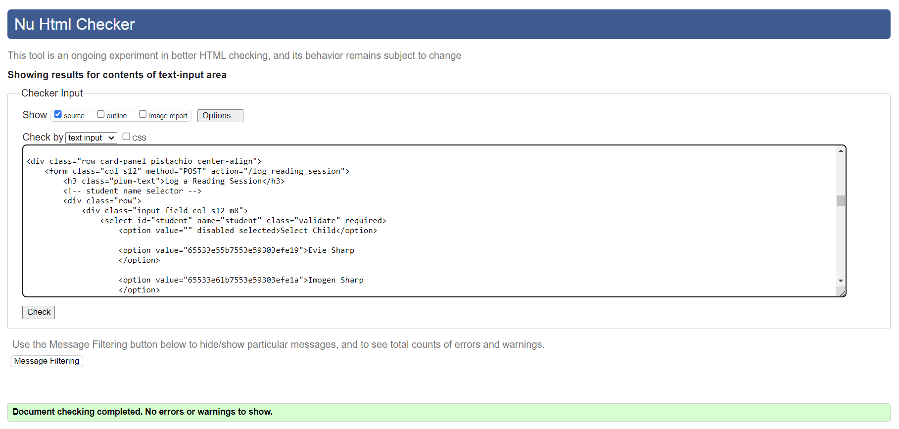
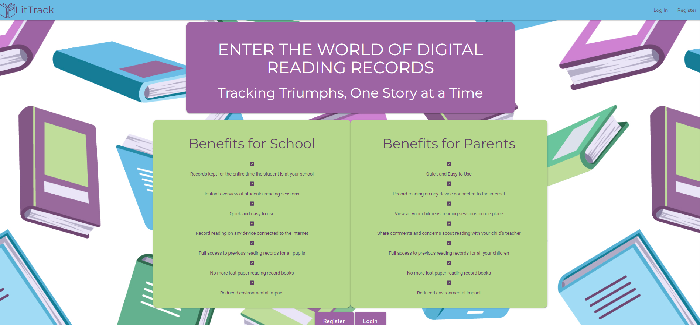
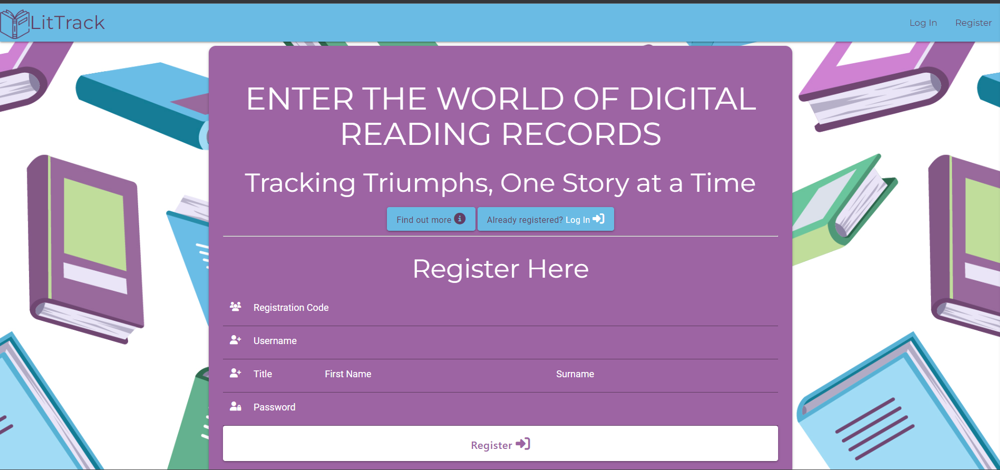
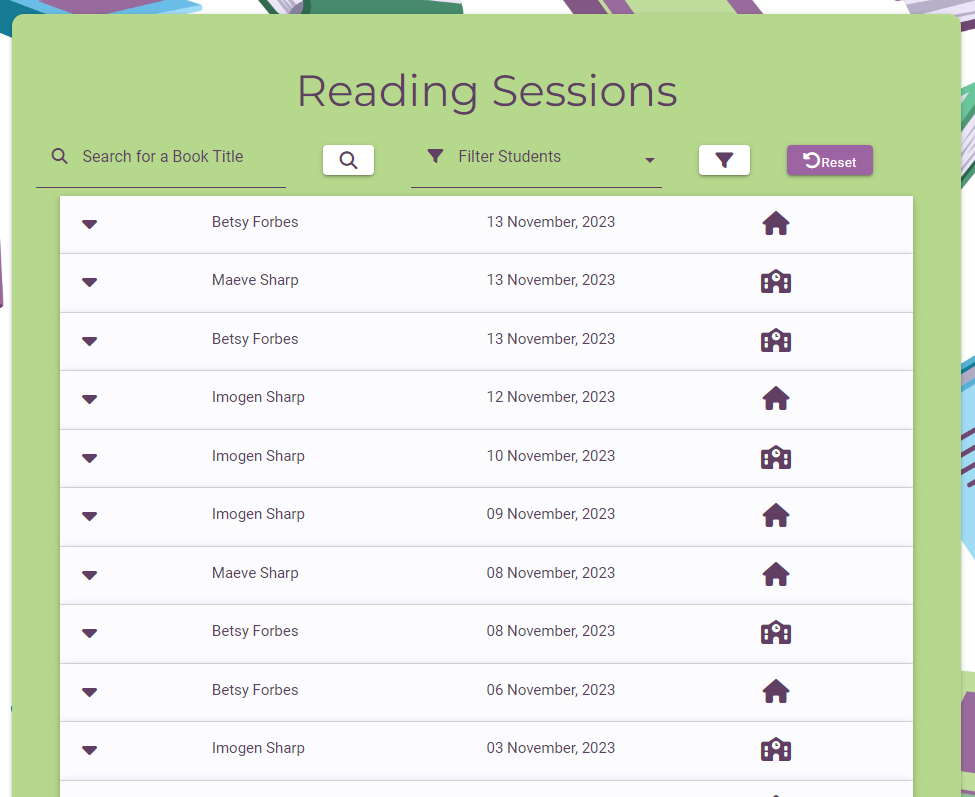
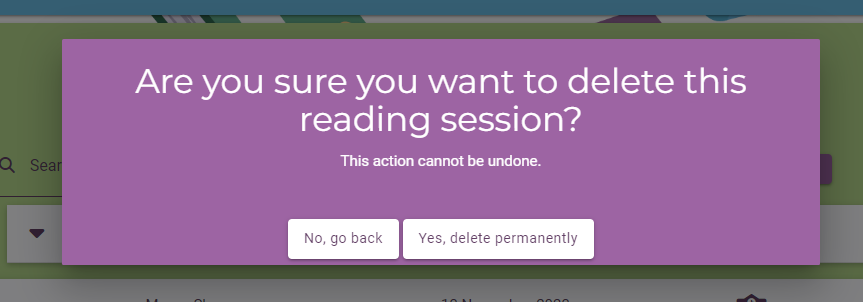

# Testing

Return back to the [README.md](README.md) file.

## Code Validation

### HTML

I have used the recommended [HTML W3C Validator](https://validator.w3.org) to validate all of my HTML files. Due to all pages (other than login, register and about_us) needing a user to be logged in to access them, I have validated the files by copying and pasting the source code from each page of the live deployed site into the validator.

| Page | W3C URL | Screenshot | Notes |
| --- | --- | --- | --- |
| login | [W3C](https://validator.w3.org/nu/?doc=https%3A%2F%2Flit-track-313aa42e46f6.herokuapp.com%2Flogin) |  | no errors or warnings |
| register | [W3C](https://validator.w3.org/nu/?doc=https%3A%2F%2Flit-track-313aa42e46f6.herokuapp.com%2Fregister) |  | No errors or warnings |
| my_reading_sessions | [W3C]() |  | No errors or warnings |
| my_students | [W3C]() |  | No errors or warnings |
| log_reading_session | [W3C]() |  | No errors or warnings |
| edit_reading_session | [W3C]() |  | No errors or warnings |
| add_student | [W3C]() |  | No errors or warnings |
| edit_student | [W3C]() |  | No errors or warnings |
| about_us | [W3C](https://validator.w3.org/nu/?doc=https%3A%2F%2Flit-track-313aa42e46f6.herokuapp.com%2Fabout_us) |  | No errors or warnings |
| 404 error page | [W3C]() |  | No errors or warnings |
| 500 error page | [W3C]() |  | No errors or warnings |
| update_reading_levels | [W3C]() |  |  |
| update_teachers | [W3C]() |  |  |

### CSS

I have used the recommended [CSS Jigsaw Validator](https://jigsaw.w3.org/css-validator) to validate all of my CSS files.

| File | Jigsaw URL | Screenshot | Notes |
| --- | --- | --- | --- |
| style.css | [Jigsaw](https://jigsaw.w3.org/css-validator/validator?uri=https%3A%2F%2Flit-track-313aa42e46f6.herokuapp.com%2Flogin&profile=css3svg&usermedium=all&warning=1&vextwarning=&lang=en) |  | Pass: All errors shown are from the imported materialize library |

### JavaScript

I have used the recommended [JShint Validator](https://jshint.com) to validate all of my JS files.

| File | Screenshot | Notes |
| --- | --- | --- |
| script.js |  | Unused variables from external files |

### Python

I have used the recommended [PEP8 CI Python Linter](https://pep8ci.herokuapp.com) to validate all of my Python files.

| File | CI URL | Screenshot | Notes |
| --- | --- | --- | --- |
| app.py | [PEP8 CI](https://pep8ci.herokuapp.com/https://raw.githubusercontent.com/laurabolwell/lit-track/main/app.py) |  | No errors |

## Browser Compatibility

I've tested my deployed project on multiple browsers to check for compatibility issues.

| Browser | Screenshot | Notes |
| --- | --- | --- |
| Chrome |  | Works as expected |
| Firefox |  | Works as expected |
| Edge |  | Works as expected |
| Brave |  | Works as expected |
| Opera |  | Minor differences |

## Responsiveness

I've tested my deployed project on multiple devices to check for responsiveness issues.

| Device | Screenshot | Notes |
| --- | --- | --- |
| Mobile (DevTools) |  | Works as expected |
| Tablet (DevTools) |  | Works as expected |
| Desktop |  | Works as expected |

## Lighthouse Audit

I've tested my deployed project using the Lighthouse Audit tool to check for any major issues.

| Page | Size | Screenshot | Notes |
| --- | --- | --- | --- |
| My Reading Sessions | Mobile |  | Some minor warnings |
| My Reading Sessions | Desktop |  | Some minor warnings |
| My Students | Mobile |  | Some minor warnings |
| My Students | Desktop |  | Few warnings |
| Edit Student | Mobile |  | |
| Edit Student | Desktop |  | |
| Log Reading Session | Mobile |  | |
| Log Reading Session | Desktop |  | |
| Login | Mobile |  | Some minor warnings |
| Login | Desktop |  | Few warnings |
| Register | Mobile |  | Some minor warnings |
| Register | Desktop |  | Few warnings |
| Update All Levels | Mobile |  | |
| Update All Levels | Desktop |  | |

## Defensive Programming

Defensive programming was manually tested with the below user acceptance testing:

| Page | User Action | Expected Result | Pass/Fail | Comments |
| --- | --- | --- | --- | --- |
| Login Page | | | | when not logged in |
| | Click on Logo | Redirection to Login page | Pass | |
| | Brute forcing the URL of every logged in page | Redirection to Login page | Pass | |
| My Reading Sessions Page | | | | |
| | Click on 'Log Reading Session' on navbar | Redirect to log_reading_session page | Pass | |
| | Click on 'My Students' on navbar | Redirect to my_students page | Pass | |
| | Click on session logged by user | Edit and delete buttons available | Pass | |
| | Click on session logged by another user | No buttons visible | Pass | |
| | Brute force URL of edit page | "You don't have access to edit this reading session" flash message and redirect to my_reading_sessions | Pass | |
| Log Reading Session Page | | | | |
| | Try to log a session when no students | Redirection to my_students and flash message | Pass | |
| | Select student | Only students of the user appear in the dropdown | Pass | |
| | Select a date | Cannot select a date in the future | Pass | |
| | Enter a 1 character title | Helper text saying input too short | Pass | |
| | Submit the form leaving comment blank | Form submits | Pass | comment is optional |
| | Submit the form leaving any other field blank | Form will not submit | Pass | |
| My Students Page | | | | |
| | Parent user clicks add student button | Redirection to add_student page | Pass | |
| | Teacher user brute forces URL of add_student page | Flash message "You don't have permission" and redirect | Pass | |
| | Click on student edit button | Redirection to edit_student page | Pass | |
| | Click on student delete button | Deletion modal triggered | Pass | |
| | Click on delete user button | Trigger appropriate deletion modal depending on if students still linked to account | Pass | |
| | Teacher clicks on update_reading_levels | Redirect to update_levels page | Pass | |
| | Teacher clicks on update_teacher button | Redirect to update_teacher page | Pass | |
| | Parent brute forces URL of an update all page | Cannot gain access | Pass | |
| Log In | | | | |
| | Click on the Login link | Redirection to Login page | Pass | |
| | Enter valid password | Field will only accept password format | Pass | |
| | Click Login button | Redirects user to home page | Pass | |
| Log Out | | | | |
| | Click Logout button | Redirects user to logout page | Pass | |
| Registration Page | | | | |
| | Enters incorrect registration code | Flash message and redirect to reg page | Pass | |
| | Enters invalid username | Cannot submit form | Pass | |
| | Enters invalid first/last name | Cannot submit form | Pass | |
| | Enters invalid password | Cannot submit form | Pass | |

## User Story Testing

| User Story | Screenshot |
| --- | --- |
| As a new site user, I would like to understand what the site is about, so that I can decide whether I would like to use it. |  |
| As a new site user, I would like to create an account, so that I can use the site. |  |
| As a parent user, I would like to easily add my children, so that I can start their digital reading record. |  |
| As a parent user, I would like to edit my child's information, so that I can correct a mistake. |  |
| As a parent user, I would like to be able to view my child's information, so that I can see their reading level and teacher at a glance. |  |
| As a parent site user, I would like to easily log a reading session, so that I can quickly and easily add to their reading record. |  |
| As a parent site user, I would like to easily view my child's reading sessions, so I can see how much they are reading and how much progress they are making. |  |
| As a parent site user, I would like to edit a reading session I have logged, so that I can correct a mistake. |  |
| As a parent user, I would like to do all the above for ALL my children from a single account. |  |
| As a parent user, I would like to see reading sessions for all my children together, but also have the option to view them for one particular child. |  |
| As a parent site user, I would like to have the option to delete a reading session I have logged. |  |
| As a parent user, I would like the option to delete my child and all their information, once they have left school. |  |
| As a parent site user, I would like the option to delete my account once all my children have left school. |  |
| As a teacher user, I should be able to see which of my students have been reading and how often, so that I can keep track of their progress. |  |
| As a teacher user, I should be able to see at a glance whether each session has been completed at home or in school, so that I can keep track of which students may need extra reading practise. |  |
| As a teacher user, I should be able to search for a book title, so I can see if a student has already read a particular book. |  |
| As a teacher user, I should be able to filter the list of reading sessions by student, so I can focus on them individually sometimes. |  |
| As a teacher user, I should be able to log reading sessions students complete in school, so that parents are aware of these. |  |
| As a teacher user, I should be able to edit a reading session, so that I can correct a mistake. |  |
| As a teacher user, I should be able to delete a reading session. |  |
| As a teacher user, I should be able to edit student details, so that I can update their teacher or reading level. |  |
| As a teacher user, I should be able to edit student reading levels for the whole class from one place, so that I can update them quickly after assessments. |  |
| As a teacher user, I should be able to edit the teacher for the whole class from one place, so that I can update them quickly if the teachers or classes are changing. |  |
| As a teacher site user, I would like the option to delete my account. |  |

## Bugs

### GitHub **Issues**

**Fixed Bugs**

All previously closed/fixed bugs can be tracked [here](https://github.com/laurabolwell/lit-track/issues?q=is%3Aissue+is%3Aclosed).

| Bug | Status |
| --- | --- |
| [School icon not displaying](https://github.com/laurabolwell/lit-track/issues/1) | Closed |
| [Updating multiple teachers not working correctly](https://github.com/laurabolwell/lit-track/issues/2) | Closed |
| [Reading sessions not displaying in date order](https://github.com/laurabolwell/lit-track/issues/3) | Closed |
| [All students available to select in dropdown when updating a reading session](https://github.com/laurabolwell/lit-track/issues/4) | Closed |
| [Icons displaying over text on all select dropdown form elements](https://github.com/laurabolwell/lit-track/issues/5) | Closed |

**Open Issues**

Any remaining open issues can be tracked [here](https://github.com/laurabolwell/lit-track/issues).

## Unfixed Bugs

⚠️⚠️⚠️⚠️⚠️ START OF NOTES (to be deleted) ⚠️⚠️⚠️⚠️⚠️

You will need to mention unfixed bugs and why they were not fixed.
This section should include shortcomings of the frameworks or technologies used.
Although time can be a big variable to consider, paucity of time and difficulty understanding
implementation is not a valid reason to leave bugs unfixed.

If you've identified any unfixed bugs, no matter how small, be sure to list them here.
It's better to be honest and list them, because if it's not documented and an assessor finds the issue,
they need to know whether or not you're aware of them as well, and why you've not corrected/fixed them.

Some examples:

🛑🛑🛑🛑🛑 END OF NOTES (to be deleted) 🛑🛑🛑🛑🛑

- On devices smaller than 375px, the page starts to have `overflow-x` scrolling.

    

    - Attempted fix: I tried to add additional media queries to handle this, but things started becoming too small to read.

- For PP3, when using a helper `clear()` function, any text above the height of the terminal does not clear, and remains when you scroll up.

    

    - Attempted fix: I tried to adjust the terminal size, but it only resizes the actual terminal, not the allowable area for text.

- When validating HTML with a semantic `section` element, the validator warns about lacking a header `h2-h6`. This is acceptable.

    

    - Attempted fix: this is a known warning and acceptable, and my section doesn't require a header since it's dynamically added via JS.

⚠️⚠️⚠️⚠️⚠️ START OF NOTES (to be deleted) ⚠️⚠️⚠️⚠️⚠️

If you legitimately cannot find any unfixed bugs or warnings, then use the following sentence:

🛑🛑🛑🛑🛑 END OF NOTES (to be deleted) 🛑🛑🛑🛑🛑

There are no remaining bugs that I am aware of.
